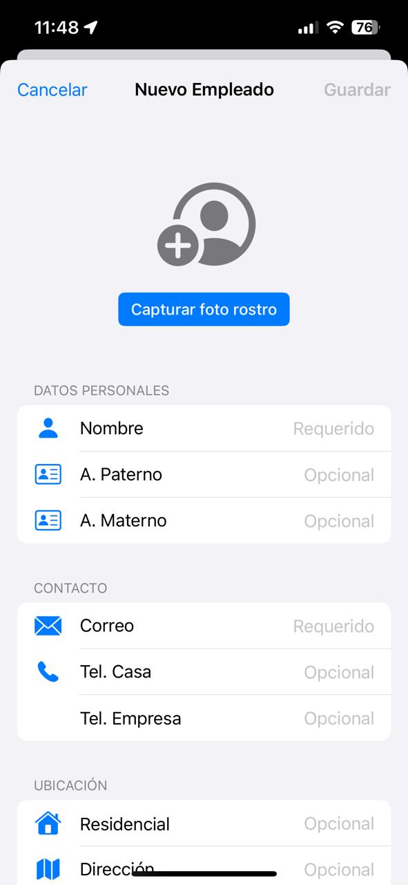
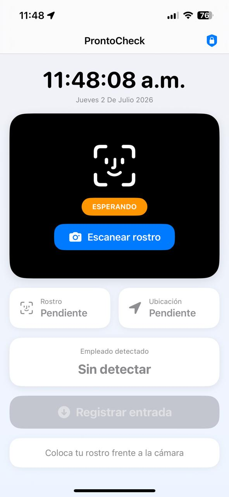
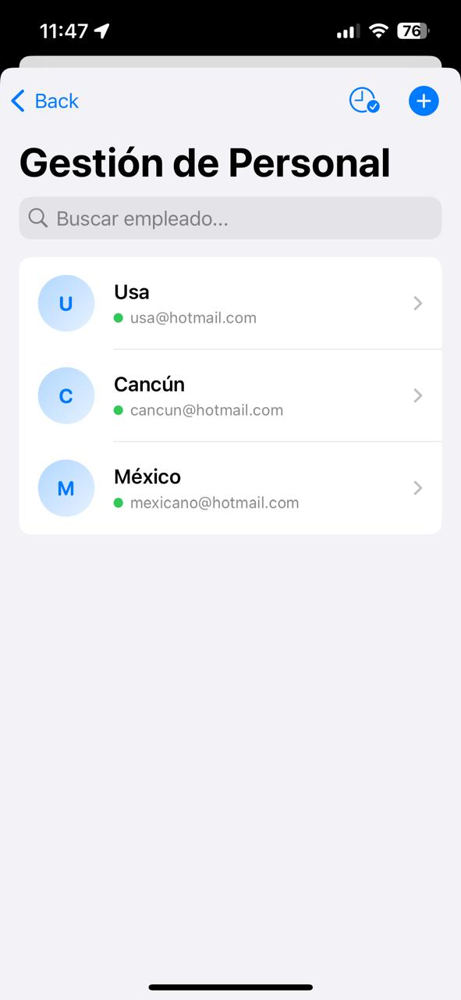

## ProntoCheck 🕒📌

**ProntoCheck** es una solución móvil nativa desarrollada en Swift para el 
control de asistencia laboral en sitio. La aplicación permite gestionar el 
alta y edición de empleados, automatizando el registro de entradas y 
salidas mediante la validación combinada de ubicación geográfica (GPS) y 
captura fotográfica (Cámara), garantizando que el personal se encuentre 
físicamente en los puntos autorizados.

## ✨ Características Principales

*   **Gestión de Personal:** Altas, bajas y edición de perfiles de 
empleados de manera intuitiva.
*   **Geolocalización Avanzada (GPS):** Validación en tiempo real de 
coordenadas específicas para asegurar que el registro se realice 
únicamente dentro del perímetro permitido (Geofencing).
*   **Validación Visual:** Integración de la cámara del dispositivo para 
capturar evidencia fotográfica al momento de checar entrada o salida.
*   **Panel de Control Local:** Historial detallado y control riguroso de 
las jornadas laborales registradas.

## 🛠️ Tecnologías y Herramientas Utilizadas

*   **Lenguaje:** Swift
*   **Interfaz de Usuario:** SwiftUI / UIKit *(Deja solo la que hayas 
usado)*
*   **Localización y Mapas:** CoreLocation (GPS y manejo de coordenadas 
específicas)
*   **Hardware y Multimedia:** AVFoundation / PhotosUI (Acceso seguro a la 
cámara)
*   **Persistencia de Datos:** CoreData / SwiftData / UserDefaults *(Deja 
la que hayas usado)*

## 📱 Capturas de Pantalla / Demostración

| Alta de Empleado | Registro de Entrada (GPS/Cámara) |
| :---: | :---: |
|  | 
 |
 |

## 🚀 Instalación y Requisitos

1. Clona este repositorio usando tu llave SSH:
   ```bash
   git clone git@github.com:luisvicente2021/ProntoCheck.git
   ```
2. Abre el archivo `ProntoCheck.xcodeproj` en Xcode.
3. Asegúrate de otorgar los permisos de **Cámara** y **Localización** al 
ejecutar la aplicación en el simulador o dispositivo físico.
